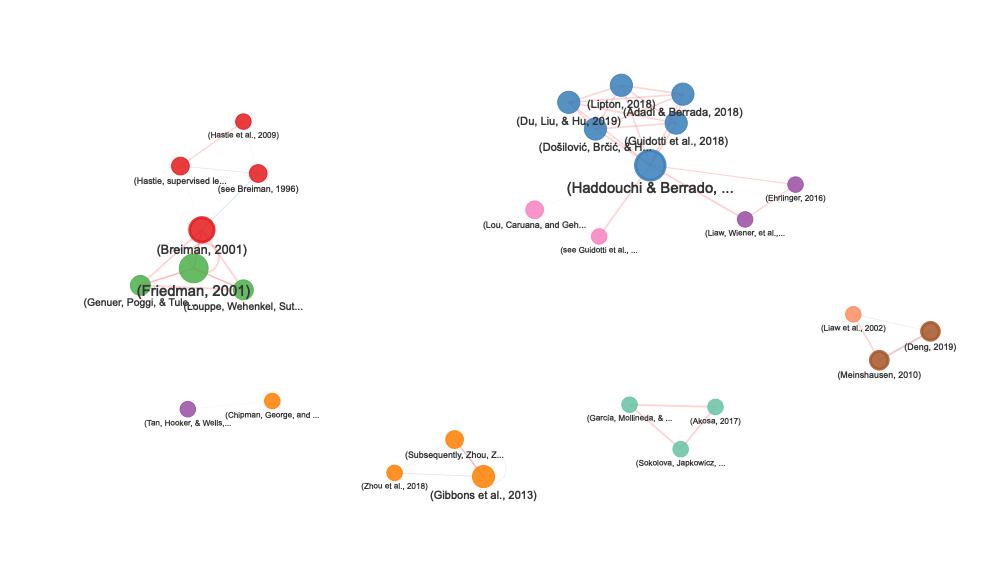

# contentanalysis

[](https://www.repostatus.org/#active) [](https://cran.r-project.org/package=contentanalysis) [](https://github.com/r-hub/cranlogs.app) [](https://cran.r-project.org/package=contentanalysis)

<p align="center">


</p>

## Overview

`contentanalysis` is a comprehensive R package designed for in-depth analysis of scientific literature. It bridges the gap between raw PDF documents and structured, analyzable data by combining advanced text extraction, citation analysis, and bibliometric enrichment from external databases.

**AI-Enhanced PDF Import**: The package supports AI-assisted PDF text extraction through Google’s Gemini API, enabling more accurate parsing of complex document layouts. To use this feature, you need to obtain an API key from [Google AI Studio](https://aistudio.google.com/apikey).

**Integration with bibliometrix**: This package complements the science mapping analyses available in `bibliometrix` and its Shiny interface `biblioshiny`. If you want to perform content analysis within a user-friendly Shiny application with all the advantages of an interactive interface, simply install `bibliometrix` and launch `biblioshiny`, where you’ll find a dedicated **Content Analysis** menu that implements all the analyses and outputs of this library.

### What Makes It Unique?

The package goes beyond simple PDF parsing by creating a multi-layered analytical framework:

1.  **Intelligent PDF Processing**: Extracts text from multi-column PDFs while preserving document structure (sections, paragraphs, references)

2.  **Citation Intelligence**: Detects and extracts citations in multiple formats (numbered, author-year, narrative, parenthetical) and maps them to their precise locations in the document

3.  **Bibliometric Enrichment**: Automatically retrieves and integrates metadata from external sources:

-   **CrossRef API**: Retrieves structured reference data including authors, publication years, journals, and DOIs
-   **OpenAlex**: Enriches references with additional metadata, filling gaps and providing comprehensive bibliographic information

4.  **Citation-Reference Linking**: Implements sophisticated matching algorithms to connect in-text citations with their corresponding references, handling various citation styles and ambiguous cases

5.  **Context-Aware Analysis**: Extracts the textual context surrounding each citation, enabling semantic analysis of how references are used throughout the document

6.  **Network Visualization**: Creates interactive networks showing citation co-occurrence patterns and conceptual relationships within the document

### The Complete Workflow

```         
PDF Document → Text Extraction → Citation Detection → Reference Parsing
↓
CrossRef/OpenAlex APIs
↓
Citation-Reference Matching → Enriched Dataset
↓
Network Analysis + Text Analytics + Bibliometric Indicators
```

The result is a rich, structured dataset that transforms a static PDF into an analyzable knowledge object, ready for: - **Content analysis**: Understanding what concepts and methods are discussed - **Citation analysis**: Examining how knowledge is constructed and referenced - **Temporal analysis**: Tracking the evolution of ideas through citation patterns - **Network analysis**: Visualizing intellectual connections - **Readability assessment**: Evaluating text complexity and accessibility

## Key Features

### PDF Import & Text Extraction

-   Multi-column layout support with automatic section detection
-   Structure preservation (title, abstract, introduction, methods, results, discussion, references)
-   Handling of complex layouts and special characters
-   DOI extraction from PDF metadata

### Citation Extraction & Analysis

-   Comprehensive detection of citation formats:
    -   **Numbered citations**: `[1]`, `[1-3]`, `[1,5,7]`
-   **Author-year citations**: `(Smith, 2020)`, `(Smith et al., 2020)`
-   **Narrative citations**: `Smith (2020) demonstrated...`
-   **Complex citations**: `(see Smith, 2020; Jones et al., 2021)`
-   Citation context extraction (surrounding text analysis)
-   Citation positioning and density metrics
-   Section-wise citation distribution

### Reference Management & Enrichment

-   **Local parsing**: Extract references from the document’s reference section
-   **CrossRef integration**: Retrieve structured metadata for cited works via DOI
-   **OpenAlex integration**: Enrich references with additional bibliographic data
-   Automatic gap-filling: Complete missing author names, years, journal names
-   Structured reference format: Standardized author lists, publication years, journals

### Citation-Reference Matching

-   Intelligent matching algorithms with multiple confidence levels:
    -   **High confidence**: Exact author-year matches
    -   **Medium confidence**: Fuzzy matching for variant author names
    -   **Disambiguation**: Handles multiple works by the same author
-   Support for various citation styles (APA, Chicago, Vancouver, etc.)
-   Handles complex cases: multiple authors, “et al.”, year suffixes (2020a, 2020b)

### Network Analysis

-   Interactive citation co-occurrence networks
-   Distance-based edge weighting (closer citations = stronger connections)
-   Section-aware visualization (color-coded by document section)
-   Multi-section citation detection (citations appearing in multiple sections)
-   Network statistics: centrality, clustering, community detection potential

### Text Analysis

-   Word frequency analysis with stopword removal
-   N-gram extraction (bigrams, trigrams)
-   Lexical diversity metrics
-   Readability indices (Flesch, Gunning Fog, SMOG, Coleman-Liau)
-   Word distribution tracking across document sections
-   Methodological term tracking

### Bibliometric Indicators

-   Citation density (citations per 1000 words)
-   Citation type distribution (narrative vs. parenthetical)
-   Co-citation analysis
-   Reference age distribution
-   Journal diversity metrics

## Installation

You can install the development version from GitHub:

``` r
# install.packages("devtools")
devtools::install_github("massimoaria/contentanalysis")
```

## Example

Complete workflow analyzing a real scientific paper:

``` r
library(contentanalysis)
```

### Download example paper

The paper is an open access article by Aria et al.:

Aria, M., Cuccurullo, C., & Gnasso, A. (2021). A comparison among interpretative proposals for Random Forests. Machine Learning with Applications, 6, 100094.

``` r
paper_url <- "https://raw.githubusercontent.com/massimoaria/contentanalysis/master/inst/examples/example_paper.pdf"
download.file(paper_url, destfile = "example_paper.pdf", mode = "wb")
```

### Import PDF with automatic section detection

``` r
doc <- pdf2txt_auto("example_paper.pdf",
                    n_columns = 2,
                    citation_type = "author_year")
#> Using 17 sections from PDF table of contents
#> Found 16 sections: Preface, Introduction, Related work, Internal processing approaches, Random forest extra information, Visualization toolkits, Post-Hoc approaches, Size reduction, Rule extraction, Local explanation, Comparison study, Experimental design, Analysis, Conclusion, Acknowledgment, References
#> Normalized 77 references with consistent \n\n separators

# Check detected sections
names(doc)
#>  [1] "Full_text"                       "Preface"                        
#>  [3] "Introduction"                    "Related work"                   
#>  [5] "Internal processing approaches"  "Random forest extra information"
#>  [7] "Visualization toolkits"          "Post-Hoc approaches"            
#>  [9] "Size reduction"                  "Rule extraction"                
#> [11] "Local explanation"               "Comparison study"               
#> [13] "Experimental design"             "Analysis"                       
#> [15] "Conclusion"                      "Acknowledgment"                 
#> [17] "References"
```

### Perform comprehensive content analysis with CrossRef and OpenAlex enrichment

``` r
analysis <- analyze_scientific_content(
  text = doc,
  doi = "10.1016/j.mlwa.2021.100094",
  mailto = "your@email.com",
  citation_type = "author_year"
)
#> Extracting author-year citations only
#> Attempting to retrieve references from CrossRef...
#> Successfully retrieved 33 references from CrossRef
#> Fetching Open Access metadata for 14 DOIs from OpenAlex...
#> Successfully retrieved metadata for 12 references from OpenAlex
```

This single function call:

1.  Extracts all citations from the document
2.  Retrieves reference metadata from CrossRef using the paper’s DOI
3.  Enriches references with additional data from OpenAlex
4.  Matches citations to references with confidence scoring
5.  Performs text analysis and computes bibliometric indicators

### View summary statistics

``` r
analysis$summary
#> $total_words_analyzed
#> [1] 3473
#> 
#> $unique_words
#> [1] 1312
#> 
#> $citations_extracted
#> [1] 50
#> 
#> $narrative_citations
#> [1] 15
#> 
#> $parenthetical_citations
#> [1] 35
#> 
#> $complex_citations_parsed
#> [1] 12
#> 
#> $lexical_diversity
#> [1] 0.3777714
#> 
#> $average_citation_context_length
#> [1] 3186.16
#> 
#> $citation_density_per_1000_words
#> [1] 6.57
#> 
#> $references_parsed
#> [1] 33
#> 
#> $citations_matched_to_refs
#> [1] 43
#> 
#> $match_quality
#> # A tibble: 3 × 3
#>   match_confidence     n percentage
#>   <chr>            <int>      <dbl>
#> 1 high                43         86
#> 2 no_match_author      6         12
#> 3 no_match_year        1          2
#> 
#> $citation_type_used
#> [1] "author_year"
```

### Readability indices

``` r
readability <- calculate_readability_indices(doc$Full_text, detailed = TRUE)
readability
#> # A tibble: 1 × 12
#>   flesch_kincaid_grade flesch_reading_ease automated_readability_index
#>                  <dbl>               <dbl>                       <dbl>
#> 1                 12.4                33.9                        11.8
#> # ℹ 9 more variables: gunning_fog_index <dbl>, n_sentences <int>,
#> #   n_words <int>, n_syllables <dbl>, n_characters <int>,
#> #   n_complex_words <int>, avg_sentence_length <dbl>,
#> #   avg_syllables_per_word <dbl>, pct_complex_words <dbl>
```

### Examine citations by type

``` r
analysis$citation_metrics$type_distribution
#> # A tibble: 10 × 3
#>    citation_type                   n percentage
#>    <chr>                       <int>      <dbl>
#>  1 parsed_from_multiple           12         24
#>  2 author_year_basic               9         18
#>  3 author_year_and                 8         16
#>  4 narrative_etal                  7         14
#>  5 author_year_etal                3          6
#>  6 narrative_three_authors_and     3          6
#>  7 narrative_two_authors_and       3          6
#>  8 narrative_four_authors_and      2          4
#>  9 see_citations                   2          4
#> 10 doi_pattern                     1          2
```

### Analyze citation contexts

``` r
head(analysis$citation_contexts[, c("citation_text_clean", "section", "full_context")])
#> # A tibble: 6 × 3
#>   citation_text_clean                        section      full_context          
#>   <chr>                                      <chr>        <chr>                 
#> 1 (Mitchell, 1997)                           Introduction on their own and make…
#> 2 (Breiman, Friedman, Olshen, & Stone, 1984) Introduction are supervised learni…
#> 3 https://doi.org/10.1016/j.mlwa.2021.100094 Introduction author E mail address…
#> 4 (Breiman, 2001)                            Introduction node of a random subs…
#> 5 (see Breiman, 1996)                        Introduction single training set a…
#> 6 (Hastie, Tibshirani, & Friedman, 2009)     Introduction by calculating predic…
```

## Citation Network Visualization

Create interactive network visualizations showing how citations co-occur within your document:

``` r
# Create citation network
network <- create_citation_network(
  citation_analysis_results = analysis,
  max_distance = 800,          # Max distance between citations (characters)
  min_connections = 2,          # Minimum connections to include a node
  show_labels = TRUE
)

# Display interactive network
network
```



### Access network statistics

``` r
stats <- attr(network, "stats")

# Network size
cat("Nodes:", stats$n_nodes, "\n")
#> Nodes: 30
cat("Edges:", stats$n_edges, "\n")
#> Edges: 48
cat("Average distance:", stats$avg_distance, "characters\n")
#> Average distance: 227 characters

# Citations by section
print(stats$section_distribution)
#>                   primary_section n
#> 1                    Related work 6
#> 2                    Introduction 5
#> 3 Random forest extra information 4
#> 4                  Size reduction 4
#> 5             Experimental design 3
#> 6          Visualization toolkits 3
#> 7               Local explanation 2
#> 8                 Rule extraction 2
#> 9                        Analysis 1

# Multi-section citations
if (nrow(stats$multi_section_citations) > 0) {
  print(stats$multi_section_citations)
}
#>                 citation_text
#> 1 (Haddouchi & Berrado, 2019)
#> 2         (Meinshausen, 2010)
#> 3                (Deng, 2019)
#>                                                         sections n_sections
#> 1 Related work, Random forest extra information, Rule extraction          3
#> 2                    Rule extraction, Comparison study, Analysis          3
#> 3                    Rule extraction, Comparison study, Analysis          3
```

### Network Features

The citation network visualization includes:

-   **Node size**: Proportional to number of connections
-   **Node color**: Indicates the primary section where citations appear
-   **Node border**: Thicker border (3px) for citations appearing in multiple sections
-   **Edge thickness**: Decreases with distance (closer citations = thicker edges)
-   **Edge color**:
    -   Red: Very close citations (≤300 characters)
-   Blue: Moderate distance (≤600 characters)
-   Gray: Distant citations (\>600 characters)
-   **Interactive features**: Zoom, pan, drag nodes, highlight neighbors on hover

### Customizing the Network

``` r
# Focus on very close citations only
network_close <- create_citation_network(
  analysis,
  max_distance = 300,
  min_connections = 1
)

# Show only highly connected citations
network_hubs <- create_citation_network(
  analysis,
  max_distance = 1000,
  min_connections = 5
)

# Hide labels for cleaner visualization
network_clean <- create_citation_network(
  analysis,
  show_labels = FALSE
)
```

## Text Analysis

### Track methodological terms across sections

``` r
method_terms <- c("machine learning", "regression", "validation", "dataset")
word_dist <- calculate_word_distribution(doc, method_terms)
```

### Create interactive visualization

``` r
# Create and save the plot
p <- plot_word_distribution(word_dist, plot_type = "line", smooth = TRUE, show_points = TRUE)

# Save as static image for GitHub
if (!dir.exists("man/figures")) dir.create("man/figures", recursive = TRUE)
htmlwidgets::saveWidget(p, "temp_plot.html", selfcontained = TRUE)
webshot::webshot("temp_plot.html", "man/figures/README-word-distribution.png", 
                 vwidth = 1000, vheight = 600)
```


``` r
file.remove("temp_plot.html")
#> [1] TRUE
```


### Examine most frequent words

``` r
head(analysis$word_frequencies, 10)
#> # A tibble: 10 × 4
#>    word         n frequency  rank
#>    <chr>    <int>     <dbl> <int>
#>  1 model       45   0.0130      1
#>  2 forest      42   0.0121      2
#>  3 accuracy    40   0.0115      3
#>  4 trees       38   0.0109      4
#>  5 random      34   0.00979     5
#>  6 learning    27   0.00777     6
#>  7 set         27   0.00777     7
#>  8 variable    26   0.00749     8
#>  9 data        25   0.00720     9
#> 10 rule        25   0.00720    10
```

### Citation co-occurrence data

``` r
head(analysis$network_data)
#> # A tibble: 6 × 5
#>   citation1                                  citation2      distance type1 type2
#>   <chr>                                      <chr>             <int> <chr> <chr>
#> 1 (Mitchell, 1997)                           (Breiman, Fri…      701 auth… auth…
#> 2 (Mitchell, 1997)                           https://doi.o…      992 auth… doi_…
#> 3 (Breiman, Friedman, Olshen, & Stone, 1984) https://doi.o…      250 auth… doi_…
#> 4 (Breiman, 2001)                            (see Breiman,…      257 auth… see_…
#> 5 (Breiman, 2001)                            (Hastie, Tibs…      617 auth… auth…
#> 6 (Breiman, 2001)                            (Hastie et al…      829 auth… auth…
```

## Working with References

### Exploring enriched reference data

``` r
# View parsed references (enriched with CrossRef and OpenAlex)
head(analysis$parsed_references[, c("ref_first_author", "ref_year", "ref_journal", "ref_source")])
#>   ref_first_author ref_year           ref_journal ref_source
#> 1            Adadi     2018           IEEE Access   crossref
#> 2             <NA>     <NA>                  <NA>   crossref
#> 3           Branco     2016 ACM Computing Surveys   crossref
#> 4          Breiman     1996      Machine Learning   crossref
#> 5          Breiman     2001      Machine Learning   crossref
#> 6          Breiman     1984   International Group   crossref

# Check data sources
table(analysis$parsed_references$ref_source)
#> 
#> crossref 
#>       33
```

The `ref_source` column indicates where the data came from:

-   `"crossref"`: Retrieved from CrossRef API
-   `"parsed"`: Extracted from document’s reference section
-   References may be enriched with OpenAlex data even if originally from CrossRef

### Analyzing citation-reference links

``` r
# View citation-reference matches with confidence levels
library(dplyr)
#> 
#> Attaching package: 'dplyr'
#> The following objects are masked from 'package:stats':
#> 
#>     filter, lag
#> The following objects are masked from 'package:base':
#> 
#>     intersect, setdiff, setequal, union
head(analysis$citation_references_mapping[, c("citation_text_clean", "ref_authors",
                                               "ref_year", "match_confidence")])
#> # A tibble: 6 × 4
#>   citation_text_clean                      ref_authors ref_year match_confidence
#>   <chr>                                    <chr>       <chr>    <chr>           
#> 1 (Mitchell, 1997)                         Mitchell    1997     high            
#> 2 (Breiman, Friedman, Olshen, & Stone, 19… Breiman     1984     high            
#> 3 https://doi.org/10.1016/j.mlwa.2021.100… <NA>        <NA>     no_match_year   
#> 4 (Breiman, 2001)                          Breiman, L. 2001     high            
#> 5 (see Breiman, 1996)                      Breiman, L. 1996     high            
#> 6 (Hastie, Tibshirani, & Friedman, 2009)   Hastie      2009     high

# Match quality distribution
table(analysis$citation_references_mapping$match_confidence)
#> 
#>            high no_match_author   no_match_year 
#>              43               6               1
```

### Finding citations to specific authors

``` r
# Find all citations to works by Smith
analysis$citation_references_mapping %>%
  filter(grepl("Smith", ref_authors, ignore.case = TRUE)) %>%
  select(citation_text_clean, ref_full_text, match_confidence)
#> # A tibble: 0 × 3
#> # ℹ 3 variables: citation_text_clean <chr>, ref_full_text <chr>,
#> #   match_confidence <chr>
```

### Accessing OpenAlex metadata

``` r
# If OpenAlex data was retrieved
if (!is.null(analysis$references_oa)) {
  # View enriched metadata
  head(analysis$references_oa[, c("title", "publication_year", "cited_by_count",
                                   "type", "oa_status")])

  # Analyze citation impact
  summary(analysis$references_oa$cited_by_count)
}
#>     Min.  1st Qu.   Median     Mean  3rd Qu.     Max. 
#>     94.0    205.5   1089.0  12844.9   7064.2 114163.0
```

### Citations by section

``` r
analysis$citation_metrics$section_distribution
#> # A tibble: 15 × 3
#>    section                             n percentage
#>    <fct>                           <int>      <dbl>
#>  1 Preface                             0          0
#>  2 Introduction                        7         14
#>  3 Related work                        9         18
#>  4 Internal processing approaches      0          0
#>  5 Random forest extra information     6         12
#>  6 Visualization toolkits              4          8
#>  7 Post-Hoc approaches                 0          0
#>  8 Size reduction                      6         12
#>  9 Rule extraction                     3          6
#> 10 Local explanation                   5         10
#> 11 Comparison study                    2          4
#> 12 Experimental design                 4          8
#> 13 Analysis                            4          8
#> 14 Conclusion                          0          0
#> 15 Acknowledgment                      0          0
```

## Advanced: Word Distribution Analysis

``` r
# Track disease-related terms
disease_terms <- c("covid", "pandemic", "health", "policy", "vaccination")
dist <- calculate_word_distribution(doc, disease_terms, use_sections = TRUE)

# View frequencies by section
dist %>%
  select(segment_name, word, count, percentage) %>%
  arrange(segment_name, desc(percentage))
#> # A tibble: 1 × 4
#>   segment_name word   count percentage
#>   <chr>        <chr>  <int>      <dbl>
#> 1 Conclusion   health     1      0.328

# Visualize trends
#plot_word_distribution(dist, plot_type = "area", smooth = FALSE)
```

## Main Functions

### PDF Import

-   `pdf2txt_auto()`: Import PDF with automatic section detection
-   `reconstruct_text_structured()`: Advanced text reconstruction
-   `extract_doi_from_pdf()`: Extract DOI from PDF metadata

### Content Analysis

-   `analyze_scientific_content()`: Comprehensive content and citation analysis with API enrichment
-   `parse_references_section()`: Parse reference list from text
-   `match_citations_to_references()`: Match citations to references with confidence scoring
-   `get_crossref_references()`: Retrieve references from CrossRef API

### Network Analysis

-   `create_citation_network()`: Create interactive citation co-occurrence network

### Text Analysis

-   `calculate_readability_indices()`: Compute readability scores (Flesch, Gunning Fog, SMOG, Coleman-Liau)
-   `calculate_word_distribution()`: Track word frequencies across document sections
-   `readability_multiple()`: Batch readability analysis for multiple documents

### Visualization

-   `plot_word_distribution()`: Interactive visualization of word distribution across sections

### Utilities

-   `get_example_paper()`: Download example paper for testing
-   `map_citations_to_segments()`: Map citations to document sections/segments

## External Data Sources

### CrossRef API

The package integrates with CrossRef’s REST API to retrieve structured bibliographic data:

-   **Endpoint**: `https://api.crossref.org/works/{doi}/references`
-   **Data retrieved**: Authors, publication year, journal/source, article title, DOI
-   **Rate limits**: Polite pool requires email (use `mailto` parameter)
-   **More info**: <https://api.crossref.org>

### OpenAlex API

OpenAlex provides comprehensive scholarly metadata:

-   **Endpoint**: Via `openalexR` package
-   **Data retrieved**: Complete author lists, citation counts, open access status, institutional affiliations
-   **Rate limits**: 100,000 requests/day (polite pool with email), 10 requests/second
-   **API key**: Optional, increases rate limits. Set with `openalexR::oa_apikey()`
-   **More info**: <https://openalex.org>

### Setting Up API Access

``` r
# For CrossRef (recommended to avoid rate limits)
analysis <- analyze_scientific_content(
  text = doc,
  doi = "10.xxxx/xxxxx",
  mailto = "your@email.com"  # Your email for CrossRef polite pool
)

# For OpenAlex (optional, increases rate limits)
# Get free API key at: https://openalex.org/
openalexR::oa_apikey("your-api-key-here")
```

## Dependencies

**Core**: pdftools, dplyr, tidyr, stringr, tidytext, tibble, httr2, visNetwork, openalexR

**Suggested**: plotly, RColorBrewer, scales (for visualization)

## Citation

If you use this package in your research, please cite:

```         
Massimo Aria & Corrado Cuccurullo (2025). contentanalysis: Scientific Content and Citation Analysis from PDF Documents.
R package version 0.2.0.
https://doi.org/10.32614/CRAN.package.contentanalysis
```

## License

GPL (\>= 3)

## Issues and Contributions

Please report issues at: <https://github.com/massimoaria/contentanalysis/issues>

Contributions are welcome! Please feel free to submit a Pull Request.
