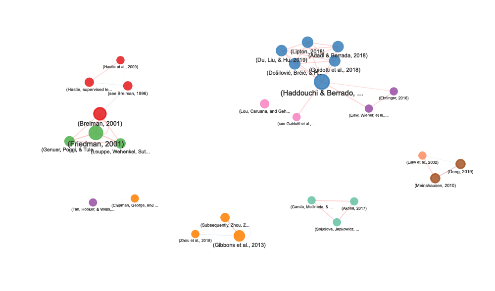
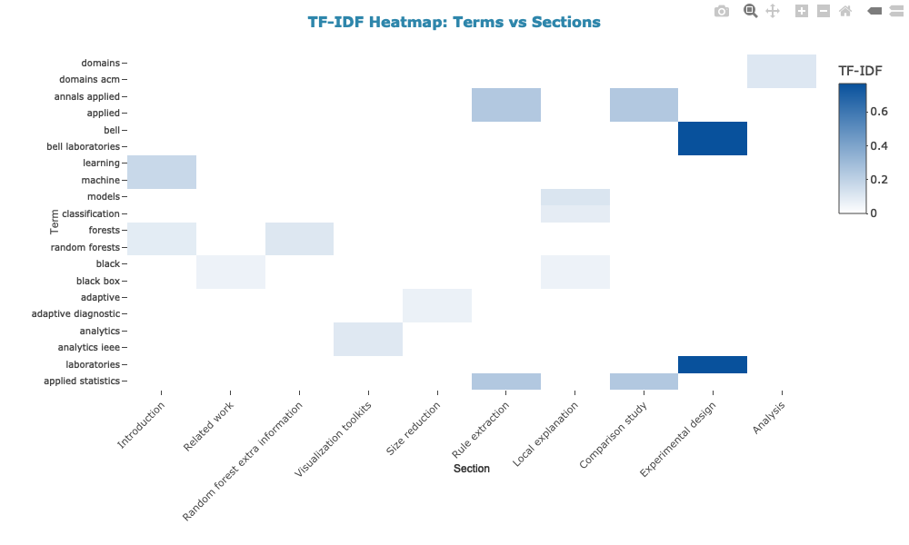
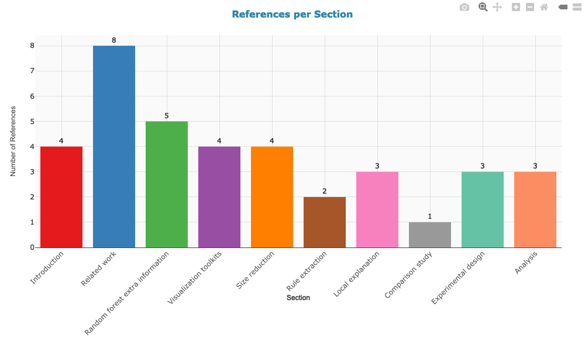

# contentanalysis

[](https://www.repostatus.org/#active)
[](https://cran.r-project.org/package=contentanalysis)
[](https://github.com/r-hub/cranlogs.app)
[](https://cran.r-project.org/package=contentanalysis)

<p align="center">


</p>

## Overview

`contentanalysis` is a comprehensive R package designed for in-depth
analysis of scientific literature. It bridges the gap between raw PDF
documents and structured, analyzable data by combining advanced text
extraction, citation analysis, and bibliometric enrichment from external
databases.

**AI-Enhanced PDF Import**: The package supports AI-assisted PDF text
extraction through Google’s Gemini API, enabling more accurate parsing
of complex document layouts. To use this feature, you need to obtain an
API key from [Google AI Studio](https://aistudio.google.com/apikey).

**Integration with bibliometrix**: This package complements the science
mapping analyses available in `bibliometrix` and its Shiny interface
`biblioshiny`. If you want to perform content analysis within a
user-friendly Shiny application with all the advantages of an
interactive interface, simply install `bibliometrix` and launch
`biblioshiny`, where you’ll find a dedicated **Content Analysis** menu
that implements all the analyses and outputs of this library.

### What Makes It Unique?

The package goes beyond simple PDF parsing by creating a multi-layered
analytical framework:

1.  **Intelligent PDF Processing**: Extracts text from multi-column PDFs
    while preserving document structure (sections, paragraphs,
    references)

2.  **Citation Intelligence**: Detects and extracts citations in
    multiple formats (numbered, author-year, narrative, parenthetical)
    and maps them to their precise locations in the document

3.  **Bibliometric Enrichment**: Automatically retrieves and integrates
    metadata from external sources:

- **CrossRef API**: Retrieves structured reference data including
  authors, publication years, journals, and DOIs
- **OpenAlex**: Enriches references with additional metadata, filling
  gaps and providing comprehensive bibliographic information

4.  **Citation-Reference Linking**: Implements sophisticated matching
    algorithms to connect in-text citations with their corresponding
    references, handling various citation styles and ambiguous cases

5.  **Context-Aware Analysis**: Extracts the textual context surrounding
    each citation, enabling semantic analysis of how references are used
    throughout the document

6.  **Network Visualization**: Creates interactive networks showing
    citation co-occurrence patterns and conceptual relationships within
    the document

7.  **Rhetorical Move Analysis**: Automatically classifies sentences
    according to their rhetorical function (Swales’ CARS model and
    extensions), combining rule-based cue phrase detection with LLM
    classification via Google Gemini API

### The Complete Workflow

    PDF Document → Text Extraction → Citation Detection → Reference Parsing
    ↓
    CrossRef/OpenAlex APIs
    ↓
    Citation-Reference Matching → Enriched Dataset
    ↓
    Network Analysis + Text Analytics + Bibliometric Indicators + Rhetorical Move Analysis

The result is a rich, structured dataset that transforms a static PDF
into an analyzable knowledge object, ready for: - **Content analysis**:
Understanding what concepts and methods are discussed - **Citation
analysis**: Examining how knowledge is constructed and referenced -
**Temporal analysis**: Tracking the evolution of ideas through citation
patterns - **Network analysis**: Visualizing intellectual connections -
**Readability assessment**: Evaluating text complexity and
accessibility - **Discourse analysis**: Mapping the rhetorical structure
of scientific argumentation

## Key Features

### PDF Import & Text Extraction

- Multi-column layout support with automatic section detection
- Structure preservation (title, abstract, introduction, methods,
  results, discussion, references)
- Handling of complex layouts and special characters
- DOI extraction from PDF metadata

### Citation Extraction & Analysis

- Comprehensive detection of citation formats:
  - **Numbered citations**: `[1]`, `[1-3]`, `[1,5,7]`
- **Author-year citations**: `(Smith, 2020)`, `(Smith et al., 2020)`
- **Narrative citations**: `Smith (2020) demonstrated...`
- **Complex citations**: `(see Smith, 2020; Jones et al., 2021)`
- Citation context extraction (surrounding text analysis)
- Citation positioning and density metrics
- Section-wise citation distribution

### Reference Management & Enrichment

- **Local parsing**: Extract references from the document’s reference
  section
- **CrossRef integration**: Retrieve structured metadata for cited works
  via DOI
- **OpenAlex integration**: Enrich references with additional
  bibliographic data
- Automatic gap-filling: Complete missing author names, years, journal
  names
- Structured reference format: Standardized author lists, publication
  years, journals

### Citation-Reference Matching

- Intelligent matching algorithms with multiple confidence levels:
  - **High confidence**: Exact author-year matches
  - **Medium confidence**: Fuzzy matching for variant author names
  - **Disambiguation**: Handles multiple works by the same author
- Support for various citation styles (APA, Chicago, Vancouver, etc.)
- Handles complex cases: multiple authors, “et al.”, year suffixes
  (2020a, 2020b)

### Network Analysis

- Interactive citation co-occurrence networks
- Distance-based edge weighting (closer citations = stronger
  connections)
- Section-aware visualization (color-coded by document section)
- Multi-section citation detection (citations appearing in multiple
  sections)
- Network statistics: centrality, clustering, community detection
  potential
- Citation cluster descriptions: TF-IDF analysis of reference titles by
  section
- Interactive plotly visualizations: bar charts, heatmaps, and reference
  density plots

### Text Analysis

- Word frequency analysis with stopword removal
- N-gram extraction (bigrams, trigrams)
- Lexical diversity metrics
- Readability indices (Flesch, Gunning Fog, SMOG, Coleman-Liau)
- Word distribution tracking across document sections
- Methodological term tracking

### Rhetorical Move Analysis

- Automatic classification of rhetorical moves at the sentence level
- Based on Swales’ CARS (Create a Research Space) model with extensions
  for Literature Review and Discussion/Conclusion sections
- Hybrid approach: rule-based cue phrase detection + LLM classification
  (Google Gemini API)
- Taxonomy coverage:
  - **Introduction**: Establishing a territory, Establishing a niche,
    Occupying the niche
  - **Literature Review / Background**: Establishing context, Reviewing
    prior work, Evaluating prior work
  - **Discussion / Conclusion**: Consolidating results, Evaluating the
    study, Looking forward
- Sentence-level output with move, step, confidence score, and
  classification method
- Automatic aggregation of consecutive sentences into rhetorical blocks
- Move flow visualization showing the argumentative structure of the
  paper
- Results/Findings sections are automatically excluded (not part of the
  rhetorical model)

### Bibliometric Indicators

- Citation density (citations per 1000 words)
- Citation type distribution (narrative vs. parenthetical)
- Co-citation analysis
- Reference age distribution
- Journal diversity metrics

## Installation

You can install the development version from GitHub:

``` r
# install.packages("devtools")
devtools::install_github("massimoaria/contentanalysis")
```

## Example

Complete workflow analyzing a real scientific paper:

``` r
library(contentanalysis)
```

### Download example paper

The paper is an open access article by Aria et al.:

Aria, M., Cuccurullo, C., & Gnasso, A. (2021). A comparison among
interpretative proposals for Random Forests. Machine Learning with
Applications, 6, 100094.

``` r
paper_url <- "https://raw.githubusercontent.com/massimoaria/contentanalysis/master/inst/examples/example_paper.pdf"
download.file(paper_url, destfile = "example_paper.pdf", mode = "wb")
```

### Import PDF with automatic section detection

``` r
doc <- pdf2txt_auto("example_paper.pdf",
                    n_columns = 2,
                    citation_type = "author_year")
#> Using 17 sections from PDF table of contents
#> Found 15 sections: Introduction, Related work, Internal processing approaches, Random forest extra information, Visualization toolkits, Post-Hoc approaches, Size reduction, Rule extraction, Local explanation, Comparison study, Experimental design, Analysis, Conclusion, Acknowledgment, References
#> Normalized 32 references with consistent \n\n separators

# Check detected sections
names(doc)
#>  [1] "Full_text"                       "Introduction"                   
#>  [3] "Related work"                    "Internal processing approaches" 
#>  [5] "Random forest extra information" "Visualization toolkits"         
#>  [7] "Post-Hoc approaches"             "Size reduction"                 
#>  [9] "Rule extraction"                 "Local explanation"              
#> [11] "Comparison study"                "Experimental design"            
#> [13] "Analysis"                        "Conclusion"                     
#> [15] "Acknowledgment"                  "References"
```

### Perform comprehensive content analysis with CrossRef and OpenAlex enrichment

``` r
analysis <- analyze_scientific_content(
  text = doc,
  doi = "10.1016/j.mlwa.2021.100094",
  mailto = "your@email.com",
  citation_type = "author_year"
)
#> Extracting author-year citations only
#> Attempting to retrieve references from CrossRef...
#> Successfully retrieved 33 references from CrossRef
#> Fetching Open Access metadata for 14 DOIs from OpenAlex...
#> Successfully retrieved metadata for 13 references from OpenAlex
#> Enriching CrossRef references with 32 PDF-parsed entries...
#> Enriched 10 CrossRef references with PDF-parsed data
```

This single function call:

1.  Extracts all citations from the document
2.  Retrieves reference metadata from CrossRef using the paper’s DOI
3.  Enriches references with additional data from OpenAlex
4.  Matches citations to references with confidence scoring
5.  Performs text analysis and computes bibliometric indicators

### View summary statistics

``` r
analysis$summary
#> $total_words_analyzed
#> [1] 3230
#> 
#> $unique_words
#> [1] 1238
#> 
#> $citations_extracted
#> [1] 49
#> 
#> $narrative_citations
#> [1] 15
#> 
#> $parenthetical_citations
#> [1] 34
#> 
#> $complex_citations_parsed
#> [1] 12
#> 
#> $lexical_diversity
#> [1] 0.3832817
#> 
#> $average_citation_context_length
#> [1] 2856.061
#> 
#> $citation_density_per_1000_words
#> [1] 6.83
#> 
#> $references_parsed
#> [1] 33
#> 
#> $citations_matched_to_refs
#> [1] 43
#> 
#> $match_quality
#> # A tibble: 2 × 3
#>   match_confidence     n percentage
#>   <chr>            <int>      <dbl>
#> 1 high                43       87.8
#> 2 no_match_author      6       12.2
#> 
#> $citation_type_used
#> [1] "author_year"
```

### Readability indices

``` r
readability <- calculate_readability_indices(doc$Full_text, detailed = TRUE)
readability
#> # A tibble: 1 × 12
#>   flesch_kincaid_grade flesch_reading_ease automated_readability_index
#>                  <dbl>               <dbl>                       <dbl>
#> 1                 12.5                34.2                        11.9
#> # ℹ 9 more variables: gunning_fog_index <dbl>, n_sentences <int>,
#> #   n_words <int>, n_syllables <dbl>, n_characters <int>,
#> #   n_complex_words <int>, avg_sentence_length <dbl>,
#> #   avg_syllables_per_word <dbl>, pct_complex_words <dbl>
```

### Examine citations by type

``` r
analysis$citation_metrics$type_distribution
#> # A tibble: 9 × 3
#>   citation_type                   n percentage
#>   <chr>                       <int>      <dbl>
#> 1 parsed_from_multiple           12      24.5 
#> 2 author_year_basic               9      18.4 
#> 3 author_year_and                 8      16.3 
#> 4 narrative_etal                  7      14.3 
#> 5 author_year_etal                3       6.12
#> 6 narrative_three_authors_and     3       6.12
#> 7 narrative_two_authors_and       3       6.12
#> 8 narrative_four_authors_and      2       4.08
#> 9 see_citations                   2       4.08
```

### Analyze citation contexts

``` r
head(analysis$citation_contexts[, c("citation_text_clean", "section", "full_context")])
#> # A tibble: 6 × 3
#>   citation_text_clean                        section      full_context          
#>   <chr>                                      <chr>        <chr>                 
#> 1 (Mitchell, 1997)                           Introduction on their own and make…
#> 2 (Breiman, Friedman, Olshen, & Stone, 1984) Introduction are supervised learni…
#> 3 (Breiman, 2001)                            Introduction node of a random subs…
#> 4 (see Breiman, 1996)                        Introduction single training set a…
#> 5 (Hastie, Tibshirani, & Friedman, 2009)     Introduction by calculating predic…
#> 6 (Hastie et al., 2009)                      Introduction accuracy is not cruci…
```

## Citation Network Visualization

Create interactive network visualizations showing how citations co-occur
within your document:

``` r
# Create citation network
network <- create_citation_network(
  citation_analysis_results = analysis,
  max_distance = 800,          # Max distance between citations (characters)
  min_connections = 2,          # Minimum connections to include a node
  show_labels = TRUE
)

# Display interactive network
network
```



### Access network statistics

``` r
stats <- attr(network, "stats")

# Network size
cat("Nodes:", stats$n_nodes, "\n")
#> Nodes: 29
cat("Edges:", stats$n_edges, "\n")
#> Edges: 50
cat("Average distance:", stats$avg_distance, "characters\n")
#> Average distance: 246.9 characters

# Citations by section
print(stats$section_distribution)
#>                   primary_section n
#> 1                    Related work 6
#> 2                    Introduction 5
#> 3                  Size reduction 4
#> 4             Experimental design 3
#> 5 Random forest extra information 3
#> 6          Visualization toolkits 3
#> 7               Local explanation 2
#> 8                 Rule extraction 2
#> 9                        Analysis 1

# Multi-section citations
if (nrow(stats$multi_section_citations) > 0) {
  print(stats$multi_section_citations)
}
#>                 citation_text
#> 1             (Breiman, 2001)
#> 2 (Haddouchi & Berrado, 2019)
#> 3         (Meinshausen, 2010)
#> 4                (Deng, 2019)
#>                                                         sections n_sections
#> 1                  Introduction, Random forest extra information          2
#> 2 Related work, Random forest extra information, Rule extraction          3
#> 3                    Rule extraction, Comparison study, Analysis          3
#> 4                    Rule extraction, Comparison study, Analysis          3
```

### Network Features

The citation network visualization includes:

- **Node size**: Proportional to number of connections
- **Node color**: Indicates the primary section where citations appear
- **Node border**: Thicker border (3px) for citations appearing in
  multiple sections
- **Edge thickness**: Decreases with distance (closer citations =
  thicker edges)
- **Edge color**:
  - Red: Very close citations (≤300 characters)
- Blue: Moderate distance (≤600 characters)
- Gray: Distant citations (\>600 characters)
- **Interactive features**: Zoom, pan, drag nodes, highlight neighbors
  on hover

### Customizing the Network

``` r
# Focus on very close citations only
network_close <- create_citation_network(
  analysis,
  max_distance = 300,
  min_connections = 1
)

# Show only highly connected citations
network_hubs <- create_citation_network(
  analysis,
  max_distance = 1000,
  min_connections = 5
)

# Hide labels for cleaner visualization
network_clean <- create_citation_network(
  analysis,
  show_labels = FALSE
)
```

## Citation Cluster Description

Describe the thematic focus of each section’s bibliography using TF-IDF
analysis of reference titles:

``` r
# Generate cluster descriptions
cluster_desc <- describe_citation_clusters(analysis, top_n = 10)

# View summary: top terms per section
cluster_desc$cluster_summary
#> # A tibble: 10 × 3
#>    section                         n_references top_terms                       
#>    <chr>                                  <int> <chr>                           
#>  1 Introduction                               5 learning, bagging, bagging pred…
#>  2 Related work                               8 interpretable machine, black, b…
#>  3 Random forest extra information            5 forests, random forests, annals…
#>  4 Visualization toolkits                     4 tree, forests, random forests, …
#>  5 Size reduction                             4 adaptive, adaptive diagnostic, …
#>  6 Rule extraction                            2 annals applied, applied, applie…
#>  7 Local explanation                          3 black, black box, box, models, …
#>  8 Comparison study                           1 annals applied, applied, applie…
#>  9 Experimental design                        3 bell, bell laboratories, labora…
#> 10 Analysis                                   3 domains, domains acm, imbalance…

# View detailed TF-IDF scores
cluster_desc$cluster_descriptions
#> # A tibble: 83 × 7
#>    section      ngram                ngram_size     n    tf   idf tf_idf
#>    <chr>        <chr>                     <int> <int> <dbl> <dbl>  <dbl>
#>  1 Introduction learning                      1     2  0.08  1.61 0.129 
#>  2 Introduction bagging                       1     1  0.04  2.30 0.0921
#>  3 Introduction bagging predictors            2     1  0.04  2.30 0.0921
#>  4 Introduction belmont                       1     1  0.04  2.30 0.0921
#>  5 Introduction belmont wadsworth             2     1  0.04  2.30 0.0921
#>  6 Introduction data                          1     1  0.04  2.30 0.0921
#>  7 Introduction data mining                   2     1  0.04  2.30 0.0921
#>  8 Introduction elements                      1     1  0.04  2.30 0.0921
#>  9 Introduction elements statistical          2     1  0.04  2.30 0.0921
#> 10 Introduction inference                     1     1  0.04  2.30 0.0921
#> # ℹ 73 more rows
```

### Visualize Citation Clusters

Create interactive plotly visualizations that complement the citation
network:

**1. TF-IDF terms per section (2-column grid layout)**


**2. Heatmap: terms vs sections (unique vs shared terms)**



**3. References per section**



The TF-IDF bar chart uses a 2-column grid layout with color-coded
section titles for a compact, readable overview. All plots display
sections in the order they appear in the paper, use consistent styling,
and include interactive hover information. Colors match the section
colors used in the citation network.

## Rhetorical Move Analysis

Automatically classify the rhetorical function of each sentence in a
scientific paper, based on Swales’ CARS model and extensions for
Literature Review and Discussion sections.

### Rule-based classification (no API key needed)

``` r
# Classify rhetorical moves using cue phrase dictionaries
moves <- classify_rhetorical_moves(doc, use_llm = FALSE)
#> Analyzing rhetorical moves in 12 sections: Introduction, Related work, Internal processing approaches, Random forest extra information, Visualization toolkits, Post-Hoc approaches, Size reduction, Rule extraction, Local explanation, Comparison study, Analysis, Conclusion
#> Segmented 194 sentences

# Sentence-level classification
head(moves$sentences[, c("sentence_id", "section", "move", "step", "confidence")])
#> # A tibble: 6 × 5
#>   sentence_id section      move                    step               confidence
#>         <dbl> <chr>        <chr>                   <chr>                   <dbl>
#> 1           1 Introduction Unclassified            Unclassified             0   
#> 2           2 Introduction Unclassified            Unclassified             0   
#> 3           3 Introduction Unclassified            Unclassified             0   
#> 4           4 Introduction M3: Occupying the niche Announcing purpose       0.45
#> 5           5 Introduction Unclassified            Unclassified             0   
#> 6           6 Introduction Unclassified            Unclassified             0
```

``` r
# Aggregated move blocks (consecutive sentences with the same move)
head(moves$move_blocks[, c("block_id", "section", "move", "n_sentences", "avg_confidence")])
#> # A tibble: 6 × 5
#>   block_id section      move                         n_sentences avg_confidence
#>      <dbl> <chr>        <chr>                              <dbl>          <dbl>
#> 1        1 Introduction Unclassified                           3           0   
#> 2        2 Introduction M3: Occupying the niche                1           0.45
#> 3        3 Introduction Unclassified                           3           0   
#> 4        4 Introduction M2: Establishing a niche               1           0.35
#> 5        5 Introduction M1: Establishing a territory           1           0.65
#> 6        6 Introduction Unclassified                           6           0
```

``` r
# Move distribution across sections
moves$summary$move_distribution
#> # A tibble: 20 × 4
#>    section                move                             n   pct
#>    <chr>                  <chr>                        <int> <dbl>
#>  1 Analysis               M1: Establishing a territory     3  42.9
#>  2 Analysis               M2: Establishing a niche         1  14.3
#>  3 Analysis               M3: Occupying the niche          3  42.9
#>  4 Comparison study       M3: Occupying the niche          1 100  
#>  5 Conclusion             M2: Evaluating the study         2  66.7
#>  6 Conclusion             M3: Looking forward              1  33.3
#>  7 Introduction           M1: Establishing a territory     2  28.6
#>  8 Introduction           M2: Establishing a niche         2  28.6
#>  9 Introduction           M3: Occupying the niche          3  42.9
#> 10 Local explanation      M1: Establishing a territory     6  85.7
#> 11 Local explanation      M2: Establishing a niche         1  14.3
#> 12 Post-Hoc approaches    M3: Occupying the niche          1 100  
#> 13 Related work           M1: Establishing context         1  50  
#> 14 Related work           M2: Reviewing prior work         1  50  
#> 15 Rule extraction        M1: Establishing a territory     1  33.3
#> 16 Rule extraction        M2: Establishing a niche         2  66.7
#> 17 Size reduction         M1: Establishing a territory     2  40  
#> 18 Size reduction         M2: Establishing a niche         2  40  
#> 19 Size reduction         M3: Occupying the niche          1  20  
#> 20 Visualization toolkits M1: Establishing a territory     3 100
```

### Hybrid classification (rule-based + Gemini LLM)

For higher accuracy, the function can combine rule-based detection with
LLM classification via Google Gemini API. This requires a Gemini API key
from [Google AI Studio](https://aistudio.google.com/apikey).

``` r
# Set your Gemini API key
Sys.setenv(GEMINI_API_KEY = "your-api-key-here")

# Hybrid classification with progress bar
moves_hybrid <- classify_rhetorical_moves(doc, use_llm = TRUE, model = "2.5-flash")

# View the rhetorical flow of the paper
moves_hybrid$summary$flow_pattern
```

### Integration with analyze_scientific_content()

Rhetorical move analysis can be activated as part of the full content
analysis pipeline:

``` r
analysis <- analyze_scientific_content(
  text = doc,
  doi = "10.1016/j.mlwa.2021.100094",
  citation_type = "author_year",
  rhetorical_moves = TRUE  # Activate rhetorical analysis
)

# Access results
analysis$rhetorical_moves$sentences
analysis$rhetorical_moves$move_blocks
analysis$rhetorical_moves$summary
```

## Text Analysis

### Track methodological terms across sections

``` r
method_terms <- c("machine learning", "regression", "validation", "dataset")
word_dist <- calculate_word_distribution(doc, method_terms)
```

### Create interactive visualization


### Examine most frequent words

``` r
head(analysis$word_frequencies, 10)
#> # A tibble: 10 × 4
#>    word            n frequency  rank
#>    <chr>       <int>     <dbl> <int>
#>  1 model          41   0.0127      1
#>  2 accuracy       40   0.0124      2
#>  3 forest         39   0.0121      3
#>  4 trees          37   0.0115      4
#>  5 random         30   0.00929     5
#>  6 set            27   0.00836     6
#>  7 variable       26   0.00805     7
#>  8 data           24   0.00743     8
#>  9 predictions    23   0.00712     9
#> 10 variables      23   0.00712    10
```

### Citation co-occurrence data

``` r
head(analysis$network_data)
#> # A tibble: 6 × 5
#>   citation1                                  citation2      distance type1 type2
#>   <chr>                                      <chr>             <int> <chr> <chr>
#> 1 (Mitchell, 1997)                           (Breiman, Fri…      701 auth… auth…
#> 2 (Breiman, Friedman, Olshen, & Stone, 1984) (Breiman, 200…      715 auth… auth…
#> 3 (Breiman, Friedman, Olshen, & Stone, 1984) (see Breiman,…      986 auth… see_…
#> 4 (Breiman, 2001)                            (see Breiman,…      257 auth… see_…
#> 5 (Breiman, 2001)                            (Hastie, Tibs…      617 auth… auth…
#> 6 (Breiman, 2001)                            (Hastie et al…      829 auth… auth…
```

## Working with References

### Exploring enriched reference data

``` r
# View parsed references (enriched with CrossRef and OpenAlex)
head(analysis$parsed_references[, c("ref_first_author", "ref_year", "ref_journal", "ref_source")])
#>   ref_first_author ref_year           ref_journal ref_source
#> 1            Adadi     2018           IEEE Access   crossref
#> 2             <NA>     <NA>                  <NA>   crossref
#> 3           Branco     2016 ACM Computing Surveys   crossref
#> 4          Breiman     1996      Machine Learning   crossref
#> 5          Breiman     2001      Machine Learning   crossref
#> 6          Breiman     1984   International Group   crossref

# Check data sources
table(analysis$parsed_references$ref_source)
#> 
#> crossref 
#>       33
```

The `ref_source` column indicates where the data came from:

- `"crossref"`: Retrieved from CrossRef API
- `"parsed"`: Extracted from document’s reference section
- References may be enriched with OpenAlex data even if originally from
  CrossRef

### Analyzing citation-reference links

``` r
# View citation-reference matches with confidence levels
library(dplyr)
#> 
#> Attaching package: 'dplyr'
#> The following objects are masked from 'package:stats':
#> 
#>     filter, lag
#> The following objects are masked from 'package:base':
#> 
#>     intersect, setdiff, setequal, union
head(analysis$citation_references_mapping[, c("citation_text_clean", "ref_authors",
                                               "ref_year", "match_confidence")])
#> # A tibble: 6 × 4
#>   citation_text_clean                      ref_authors ref_year match_confidence
#>   <chr>                                    <chr>       <chr>    <chr>           
#> 1 (Mitchell, 1997)                         Mitchell    1997     high            
#> 2 (Breiman, Friedman, Olshen, & Stone, 19… Breiman     1984     high            
#> 3 (Breiman, 2001)                          Breiman, L. 2001     high            
#> 4 (see Breiman, 1996)                      Breiman, L. 1996     high            
#> 5 (Hastie, Tibshirani, & Friedman, 2009)   Hastie      2009     high            
#> 6 (Hastie et al., 2009)                    Hastie      2009     high

# Match quality distribution
table(analysis$citation_references_mapping$match_confidence)
#> 
#>            high no_match_author 
#>              43               6
```

### Finding citations to specific authors

``` r
# Find all citations to works by Smith
analysis$citation_references_mapping %>%
  filter(grepl("Smith", ref_authors, ignore.case = TRUE)) %>%
  select(citation_text_clean, ref_full_text, match_confidence)
#> # A tibble: 0 × 3
#> # ℹ 3 variables: citation_text_clean <chr>, ref_full_text <chr>,
#> #   match_confidence <chr>
```

### Accessing OpenAlex metadata

``` r
# If OpenAlex data was retrieved
if (!is.null(analysis$references_oa)) {
  # View enriched metadata
  head(analysis$references_oa[, c("title", "publication_year", "cited_by_count",
                                   "type", "oa_status")])

  # Analyze citation impact
  summary(analysis$references_oa$cited_by_count)
}
#>    Min. 1st Qu.  Median    Mean 3rd Qu.    Max. 
#>     100     205    1062   12536    5452  120863
```

### Citations by section

``` r
analysis$citation_metrics$section_distribution
#> # A tibble: 14 × 3
#>    section                             n percentage
#>    <fct>                           <int>      <dbl>
#>  1 Introduction                        6      12.2 
#>  2 Related work                        9      18.4 
#>  3 Internal processing approaches      0       0   
#>  4 Random forest extra information     6      12.2 
#>  5 Visualization toolkits              4       8.16
#>  6 Post-Hoc approaches                 0       0   
#>  7 Size reduction                      6      12.2 
#>  8 Rule extraction                     3       6.12
#>  9 Local explanation                   5      10.2 
#> 10 Comparison study                    2       4.08
#> 11 Experimental design                 4       8.16
#> 12 Analysis                            4       8.16
#> 13 Conclusion                          0       0   
#> 14 Acknowledgment                      0       0
```

## Advanced: Word Distribution Analysis

``` r
# Track disease-related terms
disease_terms <- c("covid", "pandemic", "health", "policy", "vaccination")
dist <- calculate_word_distribution(doc, disease_terms, use_sections = TRUE)

# View frequencies by section
dist %>%
  select(segment_name, word, count, percentage) %>%
  arrange(segment_name, desc(percentage))
#> # A tibble: 1 × 4
#>   segment_name word   count percentage
#>   <chr>        <chr>  <int>      <dbl>
#> 1 Conclusion   health     1      0.330

# Visualize trends
#plot_word_distribution(dist, plot_type = "area", smooth = FALSE)
```

## Main Functions

### PDF Import

- `pdf2txt_auto()`: Import PDF with automatic section detection
- `reconstruct_text_structured()`: Advanced text reconstruction
- `extract_doi_from_pdf()`: Extract DOI from PDF metadata

### Content Analysis

- `analyze_scientific_content()`: Comprehensive content and citation
  analysis with API enrichment
- `parse_references_section()`: Parse reference list from text
- `match_citations_to_references()`: Match citations to references with
  confidence scoring
- `get_crossref_references()`: Retrieve references from CrossRef API

### Rhetorical Move Analysis

- `classify_rhetorical_moves()`: Classify sentences by rhetorical
  function (Swales’ CARS + extensions)

### Network Analysis

- `create_citation_network()`: Create interactive citation co-occurrence
  network
- `describe_citation_clusters()`: Describe citation clusters by section
  using TF-IDF on reference titles
- `plot_citation_clusters()`: Create interactive plotly visualizations
  of citation cluster descriptions (TF-IDF bars, heatmap, references per
  section)

### Text Analysis

- `calculate_readability_indices()`: Compute readability scores (Flesch,
  Gunning Fog, SMOG, Coleman-Liau)
- `calculate_word_distribution()`: Track word frequencies across
  document sections
- `readability_multiple()`: Batch readability analysis for multiple
  documents

### Visualization

- `plot_word_distribution()`: Interactive visualization of word
  distribution across sections
- `plot_citation_clusters()`: Interactive TF-IDF bar charts, heatmaps,
  and reference density plots

### Utilities

- `get_example_paper()`: Download example paper for testing
- `map_citations_to_segments()`: Map citations to document
  sections/segments

## External Data Sources

### CrossRef API

The package integrates with CrossRef’s REST API to retrieve structured
bibliographic data:

- **Endpoint**: `https://api.crossref.org/works/{doi}/references`
- **Data retrieved**: Authors, publication year, journal/source, article
  title, DOI
- **Rate limits**: Polite pool requires email (use `mailto` parameter)
- **More info**: <https://api.crossref.org>

### OpenAlex API

OpenAlex provides comprehensive scholarly metadata:

- **Endpoint**: Via `openalexR` package
- **Data retrieved**: Complete author lists, citation counts, open
  access status, institutional affiliations
- **Rate limits**: 100,000 requests/day (polite pool with email), 10
  requests/second
- **API key**: Optional, increases rate limits. Set with
  `openalexR::oa_apikey()`
- **More info**: <https://openalex.org>

### Setting Up API Access

#### Email for polite pool (recommended)

Both CrossRef and OpenAlex offer a **polite pool** for users who provide
an email address. This gives you faster and more reliable access
compared to anonymous requests. Simply pass your email via the `mailto`
parameter:

``` r
analysis <- analyze_scientific_content(
  text = doc,
  doi = "10.xxxx/xxxxx",
  mailto = "your@email.com"  # Your email for polite pool access
)
```

The `mailto` parameter is used by both CrossRef and OpenAlex to route
your requests through their polite pool, which provides higher rate
limits and priority access.

#### OpenAlex API key (optional, for extended use)

For heavier usage, OpenAlex offers a free API key that further increases
rate limits (from 10 to 100 requests/second). This is recommended if you
plan to analyze many documents in batch.

1.  Get your free API key at: <https://openalex.org/users>
2.  Set it in your R session before running the analysis:

``` r
openalexR::oa_apikey("your-api-key-here")
```

You can also add this to your `.Rprofile` so it’s automatically set at
startup:

``` r
# Add to ~/.Rprofile
openalexR::oa_apikey("your-api-key-here")
```

### Google Gemini API (for AI-enhanced features)

Both AI-enhanced PDF import and rhetorical move analysis use Google’s
Gemini API:

1.  Get your free API key at: <https://aistudio.google.com/apikey>
2.  Set it in your R session:

``` r
Sys.setenv(GEMINI_API_KEY = "your-api-key-here")
```

You can also add this to your `.Renviron` file for persistence:

``` r
# Add to ~/.Renviron
GEMINI_API_KEY=your-api-key-here
```

## Dependencies

**Core**: pdftools, dplyr, tidyr, stringr, tidytext, tibble, httr2,
visNetwork, openalexR

**Suggested**: plotly, RColorBrewer, scales (for visualization)

## Citation

If you use this package in your research, please cite:

    Massimo Aria & Corrado Cuccurullo (2025). contentanalysis: Scientific Content and Citation Analysis from PDF Documents.
    R package version 0.2.0.
    https://doi.org/10.32614/CRAN.package.contentanalysis

## License

GPL (\>= 3)

## Issues and Contributions

Please report issues at:
<https://github.com/massimoaria/contentanalysis/issues>

Contributions are welcome! Please feel free to submit a Pull Request.
